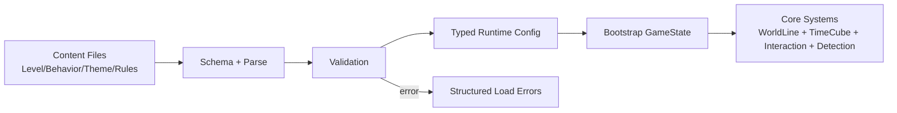
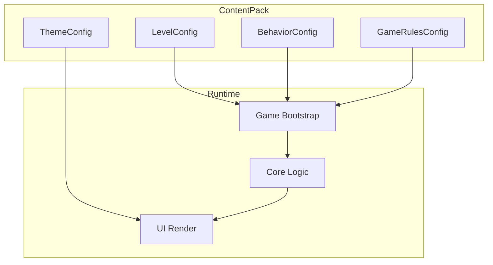
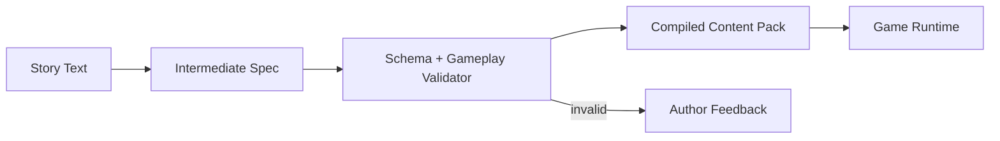

# Phase 6 Content System Design (Web)

> **Purpose:** Define exactly what Phase 6 loads, how content is structured, and how the system stays fully data-driven.
> **Scope:** Levels, objects, enemy behavior config, rift config, theme config, and future story-to-config pipeline.
> **Related:** `docs/web-implementation/PLAN.md`, `docs/web-design/CORE_DATA.md`, `docs/web-design/MATH_MODEL.md`

---

## 0. Current Reality (Post-Phase-12)

This design has been implemented as a working baseline.

Implemented now:
1. Content contracts and validation:
- `frontend/src/data/contracts.ts`
- `frontend/src/data/validate.ts`
2. Loader/boot flow from `frontend/public/data/` packs:
- `frontend/src/data/loader.ts`
- `frontend/public/data/index.json`
3. Behavior/data resolution:
- behavior policy assignment
- detection profile assignment and default fallback
4. Runtime boot from loaded content:
- `LevelConfig`, `BehaviorConfig`, `ThemeConfig`, `GameRulesConfig`
5. Generation and solvability pipeline:
- deterministic generator
- bounded gameplay-aware solver gate
- quality gate
- export CLI (`npm run gen:pack`)

Reference implementation docs:
1. `docs/web-implementation/PHASE_06_DATA_LOADING.md`
2. `docs/web-implementation/PHASE_10_ENEMY_LOGIC_DATA_DRIVEN.md`
3. `docs/web-implementation/PHASE_11_ENEMY_MOTION_EXECUTION.md`
4. `docs/web-implementation/PHASE_12_MAP_GENERATION.md`
5. `docs/web-implementation/PHASE_12_LEVEL_GENERATION_ROADMAP.md`

---

## 1. Strategic Goal

Phase 6 should not be "just file loading".
It should establish a stable **content contract layer** so gameplay can expand without reducer rewrites.

Primary target:
- all gameplay content comes from external data files
- runtime validates and loads content deterministically
- behavior tuning happens in data, not hardcoded branches

---

## 1.1 Key Diagrams

### A. Content-to-Runtime Flow

### B. Config Ownership Boundaries

### C. Future Story-to-Config Pipeline

---

## 2. Exact Scope: What We Load

Phase 6 baseline loads these assets:

1. `LevelConfig`
- map shape and dimensions
- player start
- exit
- static object placements
- dynamic object/enemy placements
- rift network entries
- level-local gameplay knobs (optional overrides)

2. `BehaviorConfig`
- enemy movement policy definitions
- enemy perception/detection parameters
- reusable behavior presets referenced by entities

3. `ThemeConfig`
- board/UI/overlay tokens (colors, line width, glyph styles)

4. `GameRulesConfig` (optional but recommended)
- default interaction config (`maxPushChain`, etc.)
- default detection config (`delayTurns`, `maxDistance`, `enabled`)

---

## 3. Data-Driven Principles

1. Runtime logic must consume typed config objects, not hardcoded level constants.
2. Config parsing and validation must fail fast with structured errors.
3. Version content contracts (`schemaVersion`) to support migration later.
4. Keep deterministic behavior:
- same input content + same player actions => same outcomes

---

## 4. Level Model

A level is composed of:

1. Map
- width, height
- optional tile mask (walkable/blocked base terrain)

2. Static items
- walls, exits, immutable markers

3. Dynamic items
- boxes, enemies, interactive objects
- each item references archetype key and optional behavior key

4. Rifts
- explicit endpoints and rule type
- support one-way or bidirectional links

5. Spawn and win anchors
- player start `(x,y,t)`
- exit placement (or equivalent win trigger object)

---

## 5. Enemy Config Model

Enemy content must be data-driven from day one.
Canonical reference: `docs/web-design/ENEMY_LOGIC_V1.md`

Baseline policy types:

1. `Static`
- enemy remains at fixed `(x,y)` for all relevant `t`

2. `PatrolLoop`
- follows path array and loops

3. `PatrolPingPong`
- follows path forward then backward

4. `ScriptedTimeline` (future-ready)
- explicit time-indexed positions

Perception block (for detection):
- detection mode (`DiscreteDelayV1` for now)
- delay turns
- max distance

Concrete v1 config pattern:
1. `policies`: reusable movement profiles
2. `assignments`: `enemy instance id -> policy key`
3. supported detection extension:
- `detectionProfiles`
- `detectionAssignments`
- `defaultDetectionProfile`

Resolution precedence:
1. movement uses direct `assignments` mapping
2. detection uses `enemy override -> behavior default profile -> rules default`

Design rule:
- behavior config is data only
- runtime behavior resolver is pure function over `(behaviorConfig, time)`

---

## 6. Rift Config in Generated/Loaded Levels

Rift behavior must be explicit in level data:

1. `anchor` rifts:
- fixed source -> fixed target `(x,y,t)`

2. `delta` rifts:
- source position + time delta rule

3. directionality:
- one-way or bidirectional

Generation/load validation requirements:
- all rift targets in bounds
- no invalid time targets
- no duplicate conflicting anchors for same source unless explicitly allowed

---

## 7. Generative Levels and Solvability

Implemented baseline:
1. Deterministic constructive generation is in place.
2. Generated candidates are schema-validated before acceptance.
3. Candidates pass a bounded gameplay-rule solver gate before acceptance.
4. Candidates pass a quality threshold gate before acceptance.
5. Accepted packs can be exported and loaded through the same public pack pipeline.

Current design limit:
1. Solver and generation remain intentionally bounded/approximate for throughput.
2. Story-driven generation and richer strategy families remain future work.

---

## 8. Story-to-Config Framework (Future)

Target architecture for plain-English authoring:

1. Author writes story prompt.
2. Translator produces intermediate structured spec (DSL/JSON draft).
3. Validator enforces schema + gameplay constraints.
4. Compiler emits final content pack (`LevelConfig`, `BehaviorConfig`, `ThemeConfig`).

Important boundary:
- LLM/tooling may assist authoring, but game runtime only consumes validated structured config.

---

## 9. Historical Execution Record (Implemented)

Implemented sequence:
1. Canonical schemas in `frontend/src/data/contracts.ts`.
2. Parser/validator layer with structured errors in `frontend/src/data/validate.ts`.
3. Loader-backed bootstrap in `frontend/src/data/loader.ts` + `frontend/src/game/gameSlice.ts`.
4. Fixture content packs under `frontend/public/data/`.
5. Behavior resolver and detection-profile precedence in data layer/runtime.
6. Generation + solvability + quality + export in `frontend/src/data/generation/`.

---

## 10. Acceptance Criteria for Phase 6

1. Game boots from external content files without hardcoded level objects.
2. Invalid content fails with actionable validation errors.
3. Enemy behavior parameters are loaded from data.
4. Theme values are loaded from data and applied.
5. At least one reference level demonstrates rift + enemy + object config.
6. Tests cover parser, validation, and bootstrap integration.

---

## 11. Open Decisions

1. Format choice for shipped content: JSON only vs JSON + authoring DSL.
2. Future authoring surface: file/CLI only vs in-app authoring UI.
3. Detection tuning UX: how much should remain global rule default vs per-enemy overrides by convention.

Current baseline decision implemented:
- JSON content packs under `frontend/public/data/`
- manifest file `frontend/public/data/index.json`
- runtime pack switching uses manifest order

---

## 12. Infrastructure Readiness Check

Current foundation is now ready for design-layer iteration and content authoring.

Ready now:
1. Dedicated data layer (contracts + validation + loader) is implemented.
2. Loader-backed bootstrap is implemented.
3. Behavior assignments and detection profile overrides are implemented.
4. Generation/solver/export pipeline is implemented and tested.
5. Deterministic test/lint/build loop is stable.

Remaining gaps (intentional):
1. No automated schema migration tooling beyond `schemaVersion` checks.
2. No in-app pack authoring UI (authoring is file/CLI workflow).
3. Story-to-config translation is not runtime-integrated.

---

## 13. Scope Lock (Updated)

Shipped baseline:
1. Canonical schemas and parser/validator.
2. Loader-backed bootstrap.
3. Behavior config loading and resolution.
4. Theme/rules config loading.
5. Fixture packs and integration tests.
6. Procedural generation with bounded solver and quality gates.

Still deferred intentionally:
1. Story-to-config translator pipeline.
2. Rich migration tooling beyond minimal version checks.
