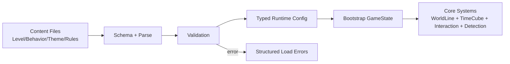
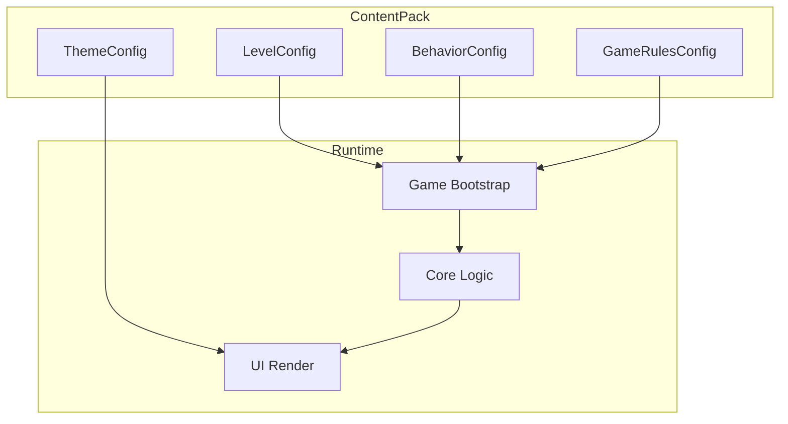
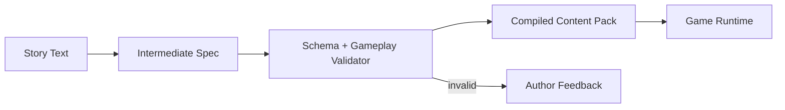

# Phase 6 Content System Design (Web)

> **Purpose:** Define exactly what Phase 6 loads, how content is structured, and how the system stays fully data-driven.
> **Scope:** Levels, objects, enemy behavior config, rift config, theme config, and future story-to-config pipeline.
> **Related:** `docs/web-implementation/PLAN.md`, `docs/web-design/CORE_DATA.md`, `docs/web-design/MATH_MODEL.md`

---

## 1. Strategic Goal

Phase 6 should not be "just file loading".
It should establish a stable **content contract layer** so gameplay can expand without reducer rewrites.

Primary target:
- all gameplay content comes from external data files
- runtime validates and loads content deterministically
- behavior tuning happens in data, not hardcoded branches

---

## 1.1 Key Diagrams

### A. Content-to-Runtime Flow

### B. Config Ownership Boundaries

### C. Future Story-to-Config Pipeline

---

## 2. Exact Scope: What We Load

Phase 6 baseline loads these assets:

1. `LevelConfig`
- map shape and dimensions
- player start
- exit
- static object placements
- dynamic object/enemy placements
- rift network entries
- level-local gameplay knobs (optional overrides)

2. `BehaviorConfig`
- enemy movement policy definitions
- enemy perception/detection parameters
- reusable behavior presets referenced by entities

3. `ThemeConfig`
- board/UI/overlay tokens (colors, line width, glyph styles)

4. `GameRulesConfig` (optional but recommended)
- default interaction config (`maxPushChain`, etc.)
- default detection config (`delayTurns`, `maxDistance`, `enabled`)

---

## 3. Data-Driven Principles

1. Runtime logic must consume typed config objects, not hardcoded level constants.
2. Config parsing and validation must fail fast with structured errors.
3. Version content contracts (`schemaVersion`) to support migration later.
4. Keep deterministic behavior:
- same input content + same player actions => same outcomes

---

## 4. Level Model

A level is composed of:

1. Map
- width, height
- optional tile mask (walkable/blocked base terrain)

2. Static items
- walls, exits, immutable markers

3. Dynamic items
- boxes, enemies, interactive objects
- each item references archetype key and optional behavior key

4. Rifts
- explicit endpoints and rule type
- support one-way or bidirectional links

5. Spawn and win anchors
- player start `(x,y,t)`
- exit placement (or equivalent win trigger object)

---

## 5. Enemy Config Model

Enemy content must be data-driven from day one.

Baseline policy types:

1. `Static`
- enemy remains at fixed `(x,y)` for all relevant `t`

2. `PatrolLoop`
- follows path array and loops

3. `PatrolPingPong`
- follows path forward then backward

4. `ScriptedTimeline` (future-ready)
- explicit time-indexed positions

Perception block (for detection):
- detection mode (`DiscreteDelayV1` for now)
- delay turns
- max distance

Design rule:
- behavior config is data only
- runtime behavior resolver is pure function over `(behaviorConfig, time)`

---

## 6. Rift Config in Generated/Loaded Levels

Rift behavior must be explicit in level data:

1. `anchor` rifts:
- fixed source -> fixed target `(x,y,t)`

2. `delta` rifts:
- source position + time delta rule

3. directionality:
- one-way or bidirectional

Generation/load validation requirements:
- all rift targets in bounds
- no invalid time targets
- no duplicate conflicting anchors for same source unless explicitly allowed

---

## 7. Generative Levels and Solvability

Ambitious target is valid, but should be staged.

Phase 6 baseline for generation:

1. Generator is optional module, not required for first loader ship.
2. Any generated level must pass a **solvability validator**:
- at least one path from start to win under configured rules

Recommended approach:

1. Constructive generation
- place start/exit/rifts/obstacles with constraints

2. Solver verification
- run deterministic state-space search
- accept level only if solution exists

3. Keep a bounded complexity budget
- cap map size, time depth, and branching factor for generation runtime

---

## 8. Story-to-Config Framework (Future)

Target architecture for plain-English authoring:

1. Author writes story prompt.
2. Translator produces intermediate structured spec (DSL/JSON draft).
3. Validator enforces schema + gameplay constraints.
4. Compiler emits final content pack (`LevelConfig`, `BehaviorConfig`, `ThemeConfig`).

Important boundary:
- LLM/tooling may assist authoring, but game runtime only consumes validated structured config.

---

## 9. Recommended Phase 6 Execution Order

Exact next step:

1. Define canonical schemas (TypeScript interfaces + JSON schema).
2. Build parser/validator layer with precise errors.
3. Replace hardcoded bootstrap with loader-backed bootstrap.
4. Add fixture content packs and integration tests.
5. Add behavior config resolver for enemy policies.
6. Add optional generator + solvability validator (if time allows in Phase 6).

---

## 10. Acceptance Criteria for Phase 6

1. Game boots from external content files without hardcoded level objects.
2. Invalid content fails with actionable validation errors.
3. Enemy behavior parameters are loaded from data.
4. Theme values are loaded from data and applied.
5. At least one reference level demonstrates rift + enemy + object config.
6. Tests cover parser, validation, and bootstrap integration.

---

## 11. Open Decisions

1. Format choice for shipped content: JSON only vs JSON + authoring DSL.
2. Whether generator ships in Phase 6 baseline or Phase 6.5.
3. Whether detection config is global per level or per enemy override by default.

---

## 12. Infrastructure Readiness Check

Current foundation is strong for Phase 6 baseline, but not for full content ambition in one step.

Ready now:
1. Deterministic core logic modules (`WorldLineState`, `TimeCube`, interactions, detection).
2. Clear truth model boundaries (player world line vs object occupancy).
3. Modular reducer pipeline that can consume loaded config.
4. Stable test/lint/build loop for regression safety.

Not ready yet:
1. No dedicated `data` layer implementation for parsing/validation.
2. Bootstrap still relies on hardcoded object config.
3. No versioned schema contracts and migration strategy in code.
4. Enemy behavior policies are not yet loaded via reusable behavior presets.
5. No solvability validator/generator runtime yet.

Implication:
- Phase 6 must be split into **baseline loader infrastructure first**, then advanced generation/authoring tooling.

---

## 13. Scope Lock for Phase 6

### Phase 6 Baseline (must ship)

1. Canonical schemas and parser/validator.
2. Loader-backed bootstrap replacing hardcoded level initialization.
3. Behavior config loading for enemy movement policy selection.
4. Theme/rules config loading.
5. Fixture content packs + integration tests.

### Post-Phase 6 (defer intentionally)

1. Procedural generator with guaranteed solvability.
2. Story-to-config translator pipeline.
3. Schema migration tooling beyond minimal `schemaVersion` checks.
